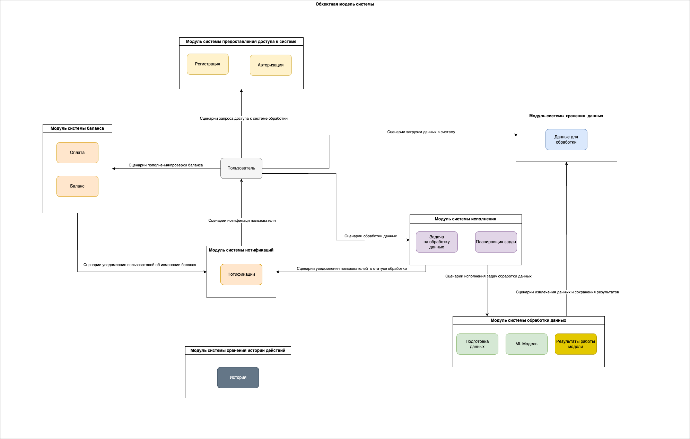
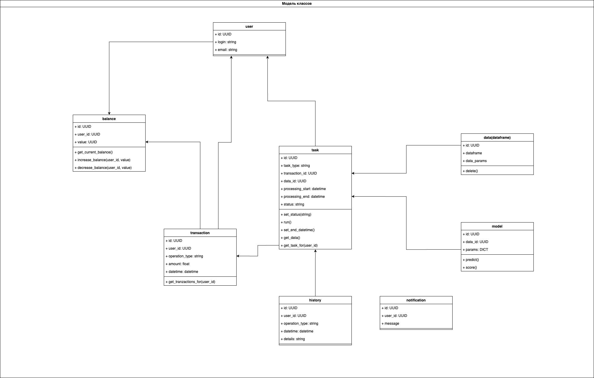

# Ml Service Practicum

# Как запустить проект

1) проверить что запущен Docker
2) запустить init.sh скрипт

- chmod +x ./init.sh
- ./init.sh

3) Дождаться завершения работы скрипта.
4) После заверешния по адресу: http://127.0.0.1/ будет доступен web-ui

### Ограничения:
На текущий момент, модель сохранена в MINIO и будет доступна, если добавить config.local в DVC.
Для проверки, можно воспользоваться конфигом:

['remote "s3_mlops"']
    access_key_id = ReH9IRQlAx9tJrP2qkvC
    secret_access_key = KO2wGKtXQFTvip7qoRV83h7odlagpY4VnjGO0M79

В продакшене, конфиг будет заполняться из переменных окружения и они не будут доступны всем.
В данный момент, креды нужны только для демонстрации.

## Init.sh

Данный скрипт, закружает модели и демо-данных из MINIO, запускается приложение и вызывает скрипт demo_init.sh в app
контейнере
demo_init.sh - инициализирует базу и создает 2х пользователей: demo-admin и demo-client
Для demo-client так же создается дефолтная исполнительная таска и пополнятеся баланс

# Функционал

API интерфейс должен содержать весь базовый функционал системы:

- [X] регистрация, авторизация,
- [X] отправка данных для предсказания,
- [X] просмотр и пополнение баланса,
- [X] просмотр истории запросов на предсказания.

# Модели сервиса

- Random Forest
- Linear Regression

## Объектная модель

## Модель классов

## Участники

| Имя | Фамилия | Ник/Почта в Mattermost |
| :--- | :--- | :--- |
| Екатерина | Костюк | kostyuk_ekaterina |
| Александр | Козачук | @apkozachuk |
| Степан | Бокарев | stepanbokarev |
| Анатолий | Трофимов | trof1mov |
| Валерия | Корнилова | kornilova.valeriia@gmail.com |

# Архитектура проекта

Система построена на микросервисной архитектуре с асинхронным взаимодействием через брокер сообщений:

1.  **Main App (API)**: Backend на FastAPI, обрабатывает запросы пользователей, управляет БД и отправляет задачи на расчет в RabbitMQ.
2.  **ML Worker**: Python-сервис, который слушает очередь RabbitMQ, загружает модели из хранилища (DVC/Minio), выполняет предсказания и сохраняет результаты.
3.  **Web UI**: Интерфейс на Streamlit для визуализации данных и взаимодействия с системой.
4.  **RabbitMQ**: Брокер сообщений для организации PUB/SUB взаимодействия между API и воркерами.
5.  **PostgreSQL**: Реляционная база данных для хранения информации о пользователях, задачах и истории.

## Безопасность и Деплой (Kubernetes)

Проект полностью контейнеризирован и развертывается в Kubernetes с помощью **Helm**.

- **RBAC**: Для каждого сервиса созданы отдельные `ServiceAccount`. Права доступа ограничены ролью `restricted-role`, разрешающей только необходимые операции (чтение ConfigMap/Secret) внутри неймспейса `team15-ns`.
- **HPA**: Настроено горизонтальное масштабирование для всех ключевых компонентов на основе загрузки CPU.
- **Probes**: Все сервисы снабжены Liveness, Readiness и Startup пробами для обеспечения отказоустойчивости.
- **Secrets**: Управление секретами осуществляется через Kubernetes Secrets и внешние хранилища (Vault).